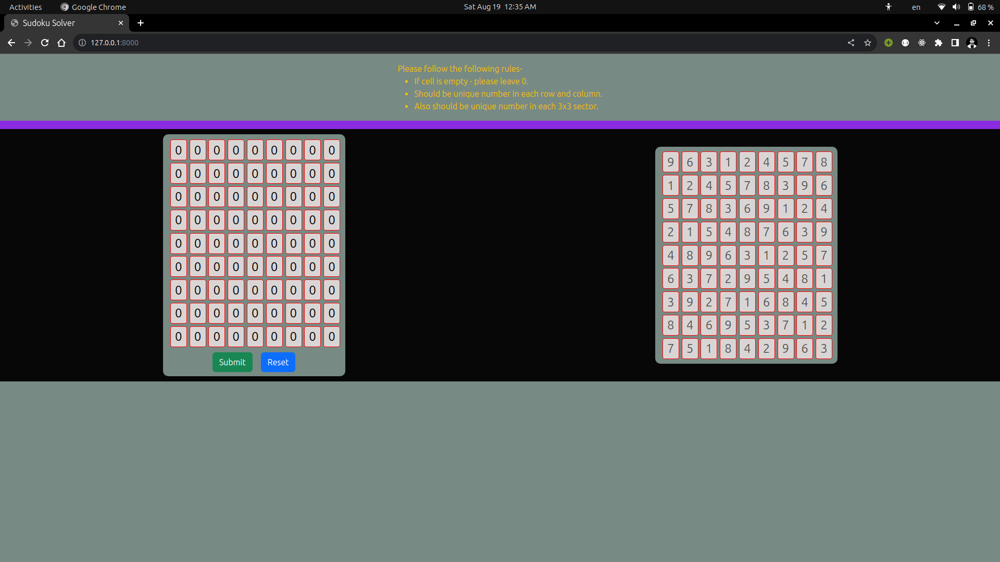

# Sudoku Solver

Welcome to Sudoku Solver, a Python program that aims to solve 9x9 Sudoku puzzles efficiently and provide a valid solution. This solver employs a backtracking algorithm to explore possible solutions.


## Table of Contents

- [Sudoku Solver](#sudoku-solver)
  - [Table of Contents](#table-of-contents)
  - [Introduction](#introduction)
  - [Features](#features)
  - [Usage](#usage)
  - [Project Structure](#project-structure)
  - [Contributing](#contributing)
  - [Acknowledgments](#acknowledgments)
  - [Sudoku Solver](#sudoku-solver-1)

## Introduction

Sudoku Solver is designed to tackle complex 9x9 Sudoku puzzles by utilizing a backtracking algorithm. It attempts to fill in the missing numbers while adhering to Sudoku rules: each row, column, and 3x3 subgrid should contain all numbers from 1 to 9 without repetition.

## Features

- **Sudoku Solving:** The program can solve valid 9x9 Sudoku puzzles by backtracking through possible solutions.


## Usage

1. **Clone the Repository:**

   ```bash
   $ git clone https://github.com/moti9/sudokuSolver.git
   $ cd sudokuSolver
    ```

2. Run the Development Server:
    ```bash
    $ python manage.py runserver
    ```

3. Access the Application:
    Visit `http://localhost:8000` in your browser.

## Project Structure
The project structure is as follows:

<code>

sudokuSolver/\
├── ReadmeImages/\
│ └── sudoku.png\
│\
├── solver/\
│ ├── migrations\
│ ├── static/\
│ | └── ...\
│ ├── templates/\
│ | ├── base.html\
│ | └── index.html\
│ ├── admin.py\
│ ├── models.py\
│ ├── urls.py\
│ └── views.py\
|\
├── sudokuSolver/\
│ ├── asgi.py\
│ ├── settings.py\
│ ├── urls.py\
│ └── wsgi.py\
|\
├── .gitignore\
├── db.sqlite\
├── manage.py\
├── README.md\
├── requirements.txt\
|\
└── ...\

</code>

## Contributing
Contributions are welcome! If you find issues or have suggestions for improvement, feel free to fork the repository and submit pull requests.

## Acknowledgments
We extend our gratitude to all contributors who have helped shape and improve the Sudoku Solver project.

## Sudoku Solver
